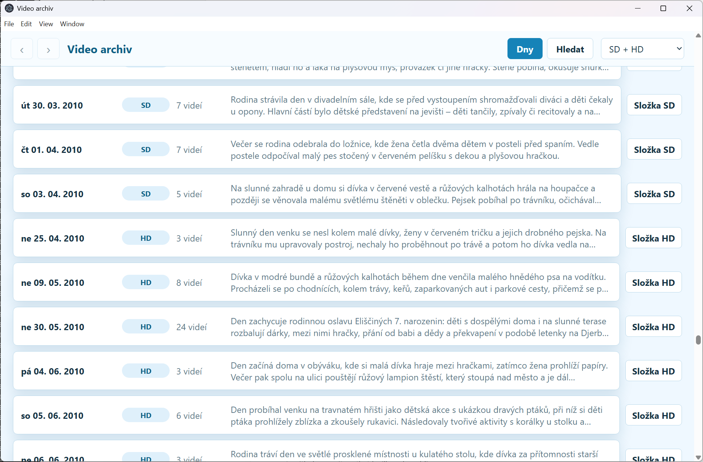
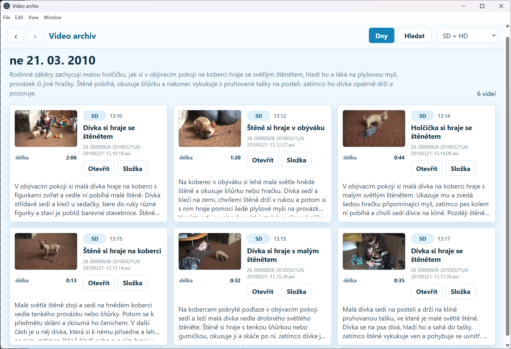
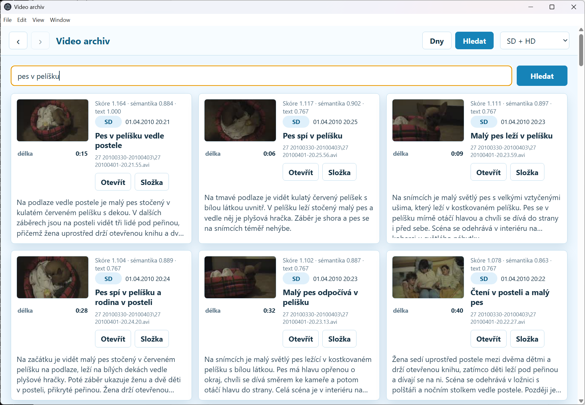

# Video Library Browser with Smart Search

## Motivation

I have almost 4 thousand videos, most of them downloaded from an ancient DV tape camera about two decades ago. Back then, I stored them in folders named like `06 20031224-20040309`, and the files were named like `06 20031225-18.42.53.avi`.  
When asked, "Play that video of our daughter's first steps", I don't know where to look.

Does it sound familiar? :smile:

Fortunately, the time has passed, and I live in the AI age now. I used Codex with my ChatGPT Plus subscription and spent $33 on GPT API tokens to process my video archive (price as of May 2026). I created an app that, when I enter "a toddler is walking down the hallway and falls," shows the video of my daughter's first steps as the top search result (yes, this was an actual test case; passed✅).

Even with AI, it wasn't a "one evening" project. I consider it worth sharing.

The visual language model processing is done as a batch job once (and can be re-run incrementally), creating offline data and an [Electron](https://www.electronjs.org/) app Windows binaries folder. I can then copy the video archive and the app folder to a removable drive and run the app from any Windows computer (it doesn't even need an internet connection). Electron is cross-platform, so this can be easily ported to other operating systems.

## Intended use of this repository

The SW in this repository is not an application you install with one click, run, and configure in the UI.  
What I'm sharing here is a tested, working, ready-for-big-batches concept that I created using an AI agent and is best used by another AI agent.

Don't get me wrong. A sufficiently IT-knowledgeable person can use this repository for running the generating scripts manually. I did. But I think it's unnecessarily difficult. There are two very detailed Product Requirement Documents. They are to provide agent memory for your AI agent session.

I recommend that you install an AI agent of your choice on your PC and give it a prompt similar to this:

`Study the repository https://github.com/viktor-nikolov/video-library-smart-search. I want to generate this video library browsing app on this PC. Clone the repository and run the necessary scripts for me. The processing can take a long time, so you must inform me regularly of progress based on the script's console output or log file. My video files are in folders <FILL FOLDER HERE> and <FILL ANOTHER FOLDER IF NEEDED>. Before running on my whole video library, do a trial run using only files in <FOLDER WITH A FEW SELECTED VIDEOS> and let me check the outcome before proceeding further. Note that the scripts in the video-library-smart-search repository generate the app in Czech. I want the app (and the smart search feature) in <YOUR DESIRED LANGUAGE>, so you need to modify the scripts accordingly. Ask me if you need any additional information or a decision.`

> [!TIP]
>
> The as-is version of the `ui_generator.py` script in this repository is designed to generate a Windows [Electron](https://www.electronjs.org/) app. If you use another operating system, tell your AI agent to update the script accordingly. The Electron framework is cross-platform.

## What This Project Provides

This repository contains two generator scripts for turning a local video archive into a searchable offline desktop library:

- `video_descr_generator.py` samples frames from each video, sends those frames to a vision-capable OpenAI model, and writes structured `video_descriptions.json` records.
- `ui_generator.py` reads one or more description JSON files and produces a portable Electron app with calendar browsing, clip thumbnails, day summaries, and local semantic search.

The scripts in this repository are intentionally file-based: the video archive stays on disk, metadata is JSON, thumbnails and embeddings are generated into the UI output folder, and the final app can run without a database server.

> [!IMPORTANT]
>
> **I made the scripts to generate text descriptions and the app UI in Czech**, my mother tongue. Changing this to a language of your choice will be a trivial task for your AI agent.
>
> Smart search will work with text descriptions in almost any language. A locally run model used to generate numeric embeddings is multilingual (see list of supported languages [here](https://huggingface.co/intfloat/multilingual-e5-small/blob/main/README.md)).

## Screenshots of the generated application

### Video List

### Day Detail

### Smart Search

## Solution Architecture

The solution has two main stages.

First, the description generator walks a video folder recursively, extracts representative frames with `ffmpeg` (up to 12 frames per video were enough for me), submits the image payloads to the configured model, validates the returned JSON, and appends one record per video. Each record includes the relative path, processing status, model metadata, timing, token usage, duration, frame timestamps, and the two VLM-produced text fields expected by the downstream UI.

Second, the UI generator merges one or more archive JSON files into a normalized library model. It computes stable video IDs, groups clips by calendar day, creates thumbnails with `ffmpeg`, asks OpenAI for per-day summaries, creates local embeddings with Transformers.js, and writes a generated Electron app into the configured output directory.

For smart search, the UI generator converts each video’s headline, description, archive label, date, and path into a numeric embedding. These embeddings are generated locally with [Transformers.js](https://github.com/huggingface/transformers.js) using [intfloat/multilingual-e5-small](https://huggingface.co/intfloat/multilingual-e5-small), a multilingual text embedding model with 384-dimensional vectors. At runtime, the Electron app embeds the user’s search query the same way and ranks videos by vector similarity, so searches can match meaning rather than only exact words. The embedding files are stored with the generated app, so search works offline after the generation step.

The generated app is static and local-first. At runtime, it reads generated JSON and binary embedding files from its own `data` folder, opens videos through local filesystem paths, and performs semantic search in the Electron renderer without calling a hosted search service.

## Workflow

1. Install Python dependencies used by the description generator, including Pillow, and the OpenAI Python SDK.
2. Install `ffmpeg` and make it available on `PATH` for video metadata, frame extraction, and thumbnails.
3. Edit `video_descr_generator.conf` so `input_dir` points at your local video archive and `output_json` points at the JSON file you want to create.
4. Set the OpenAI API key environment variable named by `api_key_env`, usually `OPENAI_API_KEY`.
5. Run `python video_descr_generator.py video_descr_generator.conf`.
6. Edit `ui_generator.conf` so each `[archive:<ID>]` section points at an archive root and its generated description JSON.
7. Run `python ui_generator.py ui_generator.conf`.
8. Launch the generated app from the configured UI output folder, for example, with `run_ui.bat`.

For quick UI experiments, you can start with `sample_data/video_descriptions.json`. The sample keeps the production schema and representative metadata (VLM text fields were translated from Czech originals to English for readability). The field names remain `headline_cs` and `description_cs` because that is what the current scripts expect.

## Configuration Files

`video_descr_generator.conf` is a runnable example for the VLM metadata stage. It uses generic relative paths such as `./sample_videos` and `./video_descriptions.json`; replace those with paths for your archive before a real run.

`ui_generator.conf` is a runnable example for the UI stage. It uses generic Windows-style paths such as `C:\VideoLibrary\Videos` and `C:\VideoLibrary\__UI_data__`; replace them with your archive and output locations. Additional archives can be added by creating more `[archive:<ID>]` sections.

Many configuration options were implemented to make testing runs easier and to avoid unnecessarily consuming ChatGPT API tokens during testing. The settings published in this repository are suitable for a production run.

The provided PRDs document the implementation history, requirements, and functionality in more detail. Their file paths have been rewritten to generic examples suitable for a public repository.

## Platform Notes

The as-is scripts were designed and tested on Windows. That mainly shows up in local path handling, generated `run_ui.bat` / `run_ui.vbs` launchers, and assumptions about opening videos with the Windows default application.

The generated application is an Electron app, so the UI layer itself is cross-platform. Porting the solution to Linux or macOS should mostly involve adapting path normalization, launcher generation, dependency commands, and local video-open behavior while keeping the data model and Electron renderer architecture intact.

## Repository Contents

- `video_descr_generator.py` - frame sampling and VLM description generator.
- `video_descr_generator_debug.py` - optional debug entry point that saves the exact JPEG frame payloads sent to the model.
- `video_descr_generator.conf` - generic sample configuration for description generation.
- `video_descr_generator_prd.md` - product requirements for the description generator.
- `ui_generator.py` - Electron app generator for browsing and search.
- `ui_generator.conf` - generic sample configuration for UI generation.
- `ui_generator_prd.md` - product requirements for the UI generator.
- `sample_data/video_descriptions.json` - small sample dataset selected from a real video archive output and translated to English.
- `app_screenshots/` - screenshots of the generated app.
